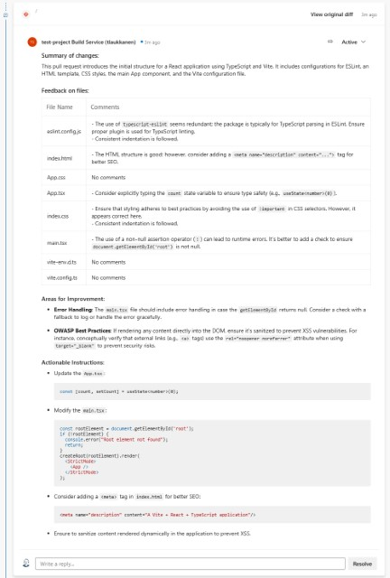
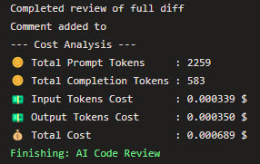

# AI Code Review DevOps Extension

<a href="https://www.buymeacoffee.com/tlaukkanen" target="_blank"></a>

## Supercharge Your Code Reviews with Azure Open AI Services

Use your own Azure OpenAI service endpoints to provide pull request code reviews while keeping your code private.

- **AI Powered Insights:** Optimized for latest LLM models like GPT-4o-mini, which provides optimal high performance with small cost.
- **Security and Privacy:** Use your own Azure OpenAI model deployment for reviews
- **Automated Summaries:** Let AI summarise your pull request so it's easier for humans to follow. AI will also provide feedback for all changes related to bugs, performance, best practices etc.
- **Easy to install:** A simple one-click installation from the [Azure DevOps Marketplace]([https://marketplace.visualstudio.com/azuredevops](https://marketplace.visualstudio.com/items?itemName=TommiLaukkanen.ai-code-review)) gets you up and running instantly. Configure to your pipeline as shown below.
- **Faster Reviews:** Reduce the time spent on code reviews. Let Open AI handle the routine, allowing your team to focus on impactful work.
- **Configurable and Customizable:** Tailor the extension to your needs with customizable settings. Specify the Open AI model, define file exclusions, and more.


## Sample review

Click for larger version:

[](screenshots/review1.jpg)

## What does it cost?

The extension itself is free. The reviews will utilize your own Azure OpenAI services so it will depend on the model that you deploy. As of today October 2024 the GPT-4o-mini seems to be optimal for this purpose and is cheap to use - today price for input prompt was $0.15 per 1M tokens, output was $0.60 per 1M tokens. While completing many pull requests the price per code review ranges from ~$0.0002 to ~$0.002 per review - so if you have 1000 PRs per month it's a [price of coffee](https://www.buymeacoffee.com/tlaukkanen) 😉

You can set the token pricing on the task parameters and then you can see from your logs how much each of the reviews cost:



## Prerequisites

- [Azure DevOps Account](https://dev.azure.com/)
- Azure OpenAI endpoint URI
- Azure OpenAI endpoint key
- Optional: Pricing for input and output tokens (check from [Azure OpenAI Pricing](https://azure.microsoft.com/en-us/pricing/details/cognitive-services/openai-service/#pricing))

## Getting started

1. Install the AI Code Review DevOps Extension from the Azure DevOps Marketplace.
2. Add Open AI Code Review Task to Your Pipeline:

  ```yaml
  trigger:
    branches:
      exclude:
        - '*'

  pr:
    branches:
      include:
        - '*'

  jobs:
  - job: CodeReview
    pool:
      vmImage: 'ubuntu-latest'
    steps:
    - task: AICodeReview@1
      inputs:
        azureOpenAiDeploymentEndpointUrl: $(AzureOpenAiDeploymentEndpoint)
        azureOpenAiApiKey: $(AzureOpenAiDeploymentKey)
        azureOpenAiApiVersion: "2024-07-01-preview"
        promptTokensPricePerMillionTokens: "0.15"
        completionTokensPricePerMillionTokens: "0.6"
        bugs: true
        performance: true
        bestPractices: true
        reviewWholeDiffAtOnce: true
        maxTokens: 16384
        fileExtensions: '.js,.ts,.css,.html,.py,.tf'
        fileExcludes: 'file1.js,file2.py,secret.txt'
        additionalPrompts: |
          Fix variable naming, Ensure consistent indentation, Review error handling approach, Check for OWASP best practices
  ```

3. If you do not already have Build Validation configured for your branch already add [Build validation](https://learn.microsoft.com/en-us/azure/devops/repos/git/branch-policies?view=azure-devops&tabs=browser#build-validation) to your branch policy to trigger the code review when a Pull Request is created

## FAQ

### Q: What agent job settings are required?

A: Ensure that "Allow scripts to access OAuth token" is enabled as part of the agent job. Follow the [documentation](https://learn.microsoft.com/en-us/azure/devops/pipelines/build/options?view=azure-devops#allow-scripts-to-access-the-oauth-token) for more details.

### Q: What permissions are required for Build Administrators?

A: Build Administrators must be given "Contribute to pull requests" access. Check [this Stack Overflow answer](https://stackoverflow.com/a/57985733) for guidance on setting up permissions.

### Bug Reports

If you find a bug or unexpected behavior, please [open a bug report](https://github.com/tlaukkanen/azure-devops-ai-code-review/issues/new?assignees=&labels=bug&template=bug_report.md&title=).

### Feature Requests

If you have ideas for new features or enhancements, please [submit a feature request](https://github.com/tlaukkanen/azure-devops-ai-code-review/issues/new?assignees=&labels=enhancement&template=feature_request.md&title=).

## License

This project is licensed under the [MIT License](LICENSE).

If you would like to contribute to the development of this extension, please follow our contribution guidelines.

Project was originally forked from [a1dancole/OpenAI-Code-Review](https://github.com/a1dancole/OpenAI-Code-Review).
